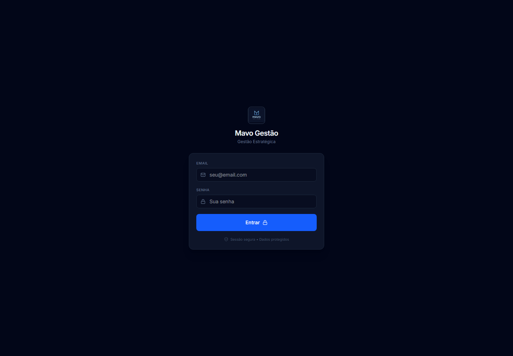
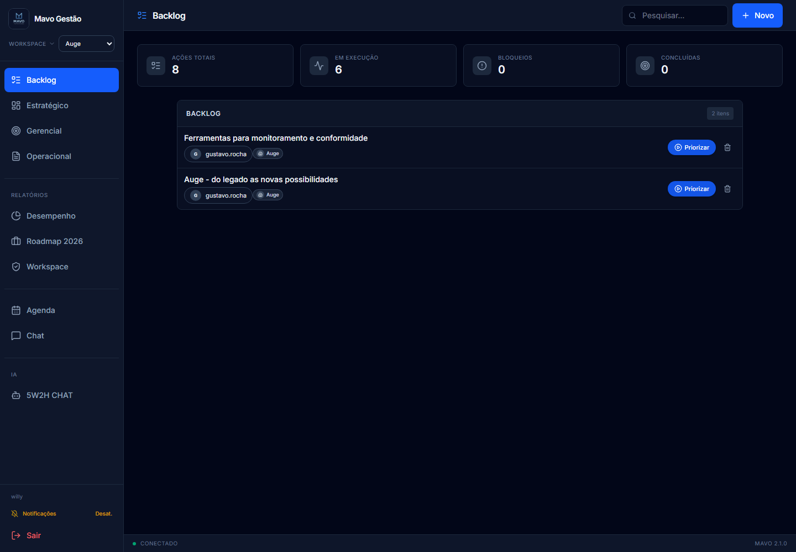
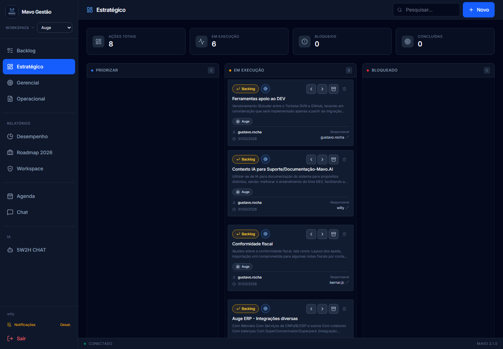
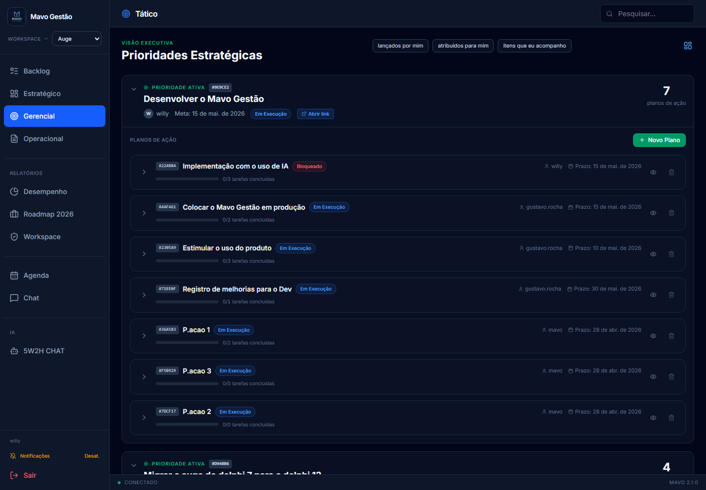
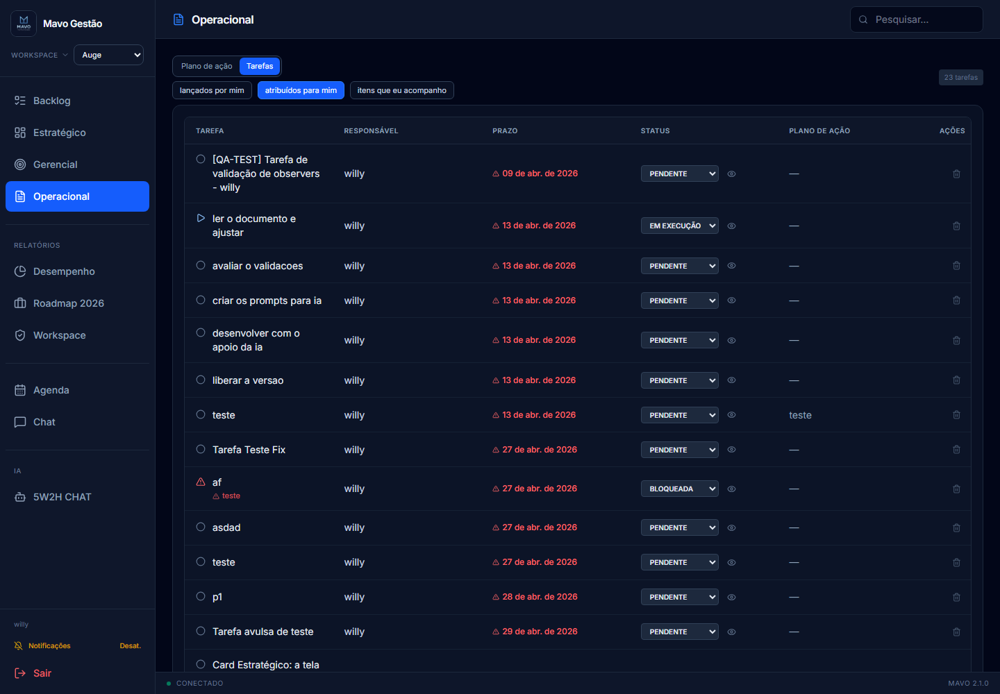
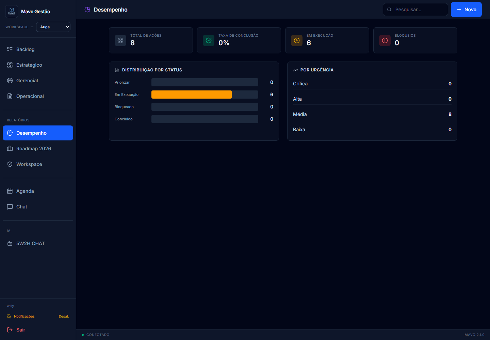
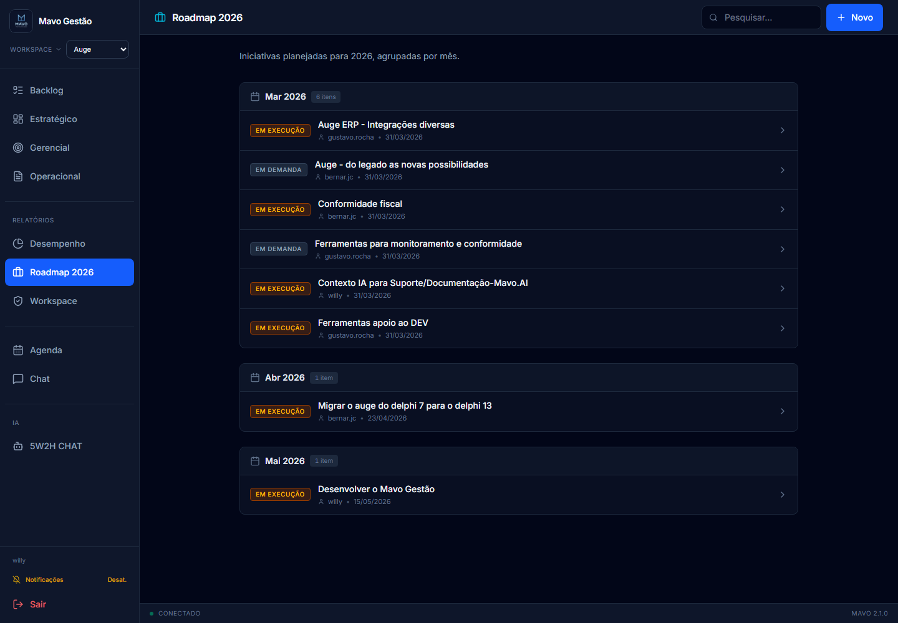
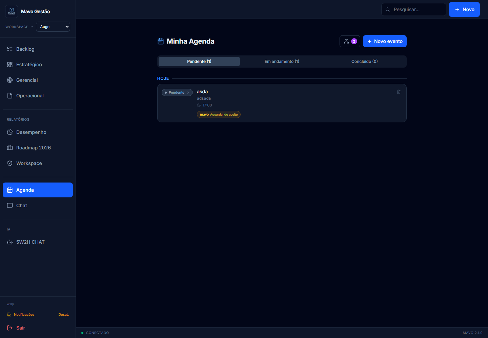
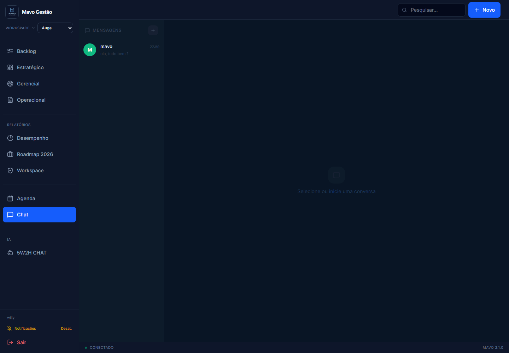
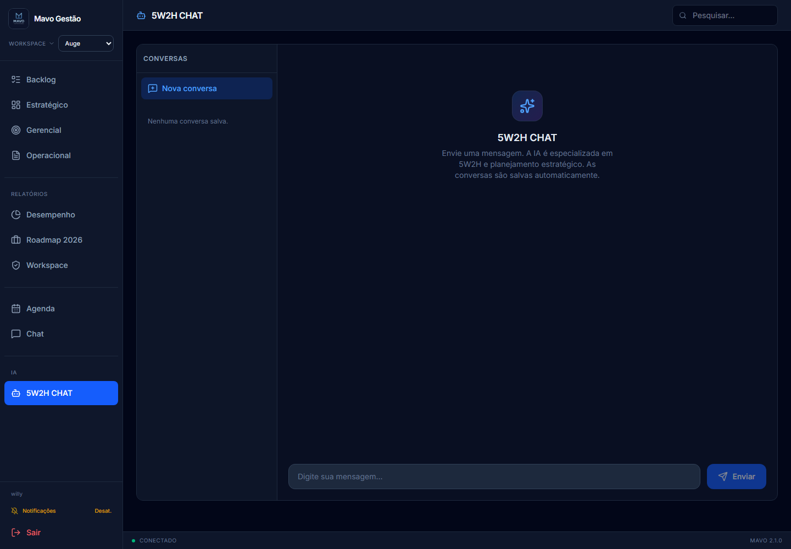

# Manual de Treinamento para Usuarios - Mavo Gestao

Este manual foi criado para pessoas que vao usar o Mavo Gestao no dia a dia.  
O objetivo nao e explicar codigo, tecnologia ou estrutura interna. O objetivo e ensinar como entrar no sistema, navegar, registrar demandas, acompanhar prioridades, atualizar tarefas e usar as ferramentas de apoio.

## 1. Para que serve o Mavo Gestao

O Mavo Gestao ajuda a organizar o trabalho da empresa em uma sequencia simples:

1. Registrar demandas no Backlog.
2. Escolher o que sera prioridade.
3. Transformar prioridades em planos de acao.
4. Dividir planos em tarefas.
5. Acompanhar execucao, bloqueios e conclusoes.

Em outras palavras: o sistema evita que ideias, problemas e combinados fiquem espalhados em conversas, planilhas ou mensagens soltas.

## 2. Como pensar o sistema

Antes de usar, memorize esta logica:

| Area | Para que serve |
|---|---|
| Backlog | Registrar ideias, problemas e demandas que ainda nao viraram prioridade |
| Estrategico | Acompanhar as iniciativas priorizadas em um quadro Kanban |
| Gerencial / Tatico | Montar planos de acao 5W2H para cada prioridade |
| Operacional | Executar e atualizar tarefas |
| Desempenho | Ver indicadores do andamento |
| Roadmap | Ver iniciativas organizadas por mes |
| Agenda | Criar compromissos e convites |
| Chat | Conversar com outros usuarios |
| 5W2H CHAT | Pedir ajuda da IA para planejamento e 5W2H |

## 3. O fluxo correto de uso

Sempre que possivel, siga esta ordem:

1. A demanda entra no Backlog.
2. O gestor avalia se ela deve ser priorizada.
3. Se virar prioridade, ela aparece no Estrategico.
4. No Gerencial/Tatico, a prioridade recebe um plano de acao.
5. O plano e dividido em tarefas.
6. No Operacional, os responsaveis atualizam as tarefas.
7. O gestor acompanha bloqueios, atrasos e conclusoes.

Nem tudo que entra no Backlog deve virar prioridade. O Backlog e uma fila de analise. Prioridade e foco real.

## Treinamento visual pelas telas do sistema

As imagens abaixo mostram as telas reais do Mavo Gestao. Em cada tela, o print aparece primeiro e a explicacao vem logo abaixo, com orientacoes praticas para o usuario.

### Tela de login

Nesta tela o usuario entra no sistema usando email e senha. Cada pessoa deve acessar com seu proprio usuario, porque as permissoes, empresas e tarefas aparecem conforme o perfil logado.

O que fazer:

1. Digitar o email cadastrado.
2. Digitar a senha.
3. Clicar em Entrar.
4. Aguardar o carregamento do painel.

Se a pessoa nao conseguir entrar, deve procurar o administrador para verificar senha, perfil ativo ou cadastro.

### Tela Backlog

O Backlog e a entrada de novas demandas. Tudo que ainda e ideia, problema, melhoria ou pedido em analise deve comecar aqui. Antes de criar qualquer item, confira o workspace no menu lateral para garantir que a demanda fique na empresa correta.

O que observar:

- O menu lateral mostra as areas do sistema.
- O seletor de Workspace indica a empresa/contexto atual.
- A lista central mostra as demandas registradas.
- O botao Novo aparece quando o usuario tem permissao para criar.
- O campo Pesquisar ajuda a localizar demandas por palavra-chave.

Como usar:

1. Selecionar o workspace correto.
2. Clicar em Novo.
3. Preencher titulo e descricao.
4. Adicionar link de apoio, se existir.
5. Salvar a demanda.
6. Usar Priorizar apenas quando a demanda realmente deve virar foco de gestao.

### Tela Estrategico

O Estrategico mostra as iniciativas priorizadas em formato Kanban. Ele serve para acompanhar rapidamente o que esta em priorizacao, em execucao, bloqueado ou concluido.

O que observar:

- Cada card representa uma iniciativa.
- As colunas indicam o momento da iniciativa.
- Cards bloqueados precisam de atencao.
- Cards concluidos ficam separados em uma area propria.
- Alguns usuarios podem mover cards; outros apenas visualizam.

Como usar:

1. Conferir em qual coluna cada iniciativa esta.
2. Abrir o card para ver detalhes, se tiver permissao.
3. Mover para Em Execucao quando a iniciativa comecar.
4. Mover para Bloqueado quando houver impedimento.
5. Arquivar como concluido quando terminar.
6. Usar o atalho para o Gerencial/Tatico quando precisar detalhar plano e tarefas.

### Tela Gerencial / Tatico

O Gerencial/Tatico e onde a prioridade vira plano de acao. Nesta tela o gestor ou responsavel organiza cada prioridade em planos 5W2H e depois divide esses planos em tarefas.

O que observar:

- A prioridade aparece como bloco principal.
- Dentro da prioridade ficam os planos de acao.
- Cada plano mostra responsavel, prazo e status.
- Planos bloqueados indicam que alguma tarefa pode estar impedindo o andamento.
- O botao Novo Plano aparece para quem tem permissao.
- Os filtros ajudam a ver itens lancados por mim, atribuidos para mim ou acompanhados.

Como usar:

1. Abrir a prioridade desejada.
2. Criar ou revisar o plano de acao.
3. Preencher os campos do 5W2H.
4. Criar tarefas objetivas dentro do plano.
5. Definir responsavel e vencimento para cada tarefa.
6. Acompanhar bloqueios e progresso das tarefas.

### Tela Operacional

O Operacional e a tela de rotina de quem executa o trabalho. Ela permite acompanhar tarefas, atualizar status, bloquear com motivo e concluir entregas.

O que observar:

- A aba Plano de acao mostra tarefas dentro do contexto do plano.
- A aba Tarefas mostra uma visao mais direta da execucao.
- Tarefas atrasadas ou bloqueadas precisam de atencao.
- O status da tarefa deve refletir a realidade do trabalho.
- Tarefas concluidas saem da lista ativa.

Como usar:

1. Abrir Operacional no inicio do dia.
2. Ver as tarefas pendentes e em execucao.
3. Atualizar para EmExecucao quando comecar.
4. Bloquear com motivo quando houver impedimento.
5. Marcar como Concluida quando finalizar.
6. Avisar o gestor quando um bloqueio impactar prazo ou prioridade.

### Tela Desempenho

O Desempenho mostra indicadores do andamento das iniciativas. Ele ajuda gestores a entender se existem muitos bloqueios, se as entregas estao avancando e qual e a distribuicao dos itens por status.

O que observar:

- Total de acoes.
- Taxa de conclusao.
- Quantidade em execucao.
- Quantidade de bloqueios.
- Distribuicao por status.
- Lista de itens bloqueados.

Como usar:

1. Abrir antes de reunioes de acompanhamento.
2. Verificar se os bloqueios estao aumentando.
3. Identificar prioridades que precisam de decisao.
4. Comparar volume de itens em execucao com itens concluidos.
5. Usar os dados para cobrar atualizacao de tarefas e planos.

### Tela Roadmap 2026

O Roadmap mostra iniciativas organizadas por mes. Ele ajuda a visualizar prazos, concentracao de entregas e planejamento futuro.

O que observar:

- As iniciativas ficam agrupadas por mes.
- Cada item mostra responsavel e data.
- Itens sem data correta podem aparecer fora do mes esperado.
- A tela e mais voltada a planejamento do que execucao diaria.

Como usar:

1. Abrir Roadmap para analisar planejamento.
2. Verificar quais meses estao mais carregados.
3. Conferir se as datas fazem sentido.
4. Ajustar prazos no item original quando necessario e quando houver permissao.

### Tela Agenda

A Agenda serve para compromissos, reunioes e convites. Ela ajuda a organizar eventos do usuario e permite convidar participantes.

O que observar:

- O botao de novo evento.
- A lista de eventos por status.
- Convites pendentes.
- Participantes do evento.
- Status: pendente, em andamento ou concluido.

Como usar:

1. Criar evento com titulo, data e hora.
2. Adicionar descricao se necessario.
3. Selecionar participantes.
4. Responder convites recebidos.
5. Informar motivo quando recusar.
6. Concluir eventos ja realizados.

### Tela Chat

O Chat e usado para conversa direta entre usuarios do sistema. Ele e util para alinhamentos rapidos, duvidas e combinados.

O que observar:

- Lista de usuarios ou conversas.
- Area principal da conversa.
- Campo para digitar mensagem.
- Indicador de mensagens nao lidas no menu lateral.

Como usar:

1. Abrir Chat.
2. Escolher o usuario.
3. Digitar a mensagem.
4. Enviar.
5. Registrar no item correto qualquer decisao importante tomada na conversa.

### Tela 5W2H CHAT

O 5W2H CHAT e uma IA de apoio para planejamento. Ele ajuda a organizar ideias, melhorar textos, criar planos 5W2H e transformar demandas em tarefas.

O que observar:

- Lista de conversas salvas.
- Area de mensagens.
- Campo de envio.
- Botao Nova conversa.

Como usar:

1. Digitar uma pergunta clara.
2. Pedir ajuda para montar plano, tarefa, descricao ou analise.
3. Ler a resposta com senso critico.
4. Ajustar o texto antes de copiar para o sistema.
5. Criar nova conversa quando mudar de assunto.

Exemplos de perguntas:

- "Monte um plano 5W2H para reduzir divergencia de estoque."
- "Transforme esta demanda em tarefas operacionais."
- "Melhore a descricao deste backlog."
- "Quais riscos devo acompanhar nesta prioridade?"

## 4. Entrando no sistema

1. Abra o link do sistema no navegador.
2. Informe seu email.
3. Informe sua senha.
4. Clique em Entrar.

Se o login falhar:

| Mensagem ou situacao | O que fazer |
|---|---|
| Email ou senha incorretos | Verifique os dados digitados ou solicite redefinicao de senha |
| Conta desativada | Fale com o administrador |
| Perfil nao encontrado | Fale com o administrador |
| Tela carregando por muito tempo | Atualize a pagina e tente novamente |

## 5. Entendendo o menu lateral

Depois de entrar, voce vera o menu lateral. Ele e o caminho principal para navegar.

Principais botoes:

- Backlog: registrar e consultar demandas.
- Estrategico: acompanhar prioridades no Kanban.
- Gerencial: trabalhar prioridades, planos e tarefas.
- Operacional: atualizar tarefas e execucao.
- Desempenho: consultar indicadores.
- Roadmap 2026: ver iniciativas por mes.
- Workspace: trocar empresa/contexto ou abrir link externo.
- Agenda: ver compromissos.
- Chat: conversar com usuarios.
- 5W2H CHAT: conversar com a IA.
- Notificacoes: ativar/desativar avisos do navegador.
- Sair: encerrar a sessao.

Alguns botoes podem nao aparecer para voce. Isso depende das permissoes do seu perfil.

## 6. Escolhendo o workspace correto

Workspace e a empresa, cliente, unidade ou contexto em que voce esta trabalhando.

Antes de criar qualquer item, confira o workspace no topo do menu lateral.

Exemplo:

- Se voce vai registrar uma demanda da empresa "Mais Varejo", selecione "Mais Varejo".
- Se voce tem acesso a varias empresas, pode aparecer "Todas as empresas".
- Se voce so tem acesso a uma empresa, o sistema pode selecionar automaticamente.

Boa pratica: nunca lance um item antes de conferir o workspace.

## 7. Usando o Backlog

O Backlog e onde novas demandas entram.

Use o Backlog para registrar:

- ideias;
- problemas;
- pedidos de cliente;
- melhorias;
- assuntos que precisam ser analisados;
- oportunidades que ainda nao viraram prioridade.

Nao use o Backlog para tarefas pequenas do dia a dia. Tarefas devem ficar no Operacional, dentro de um plano.

### 7.1 Criar uma demanda no Backlog

1. Clique em Backlog.
2. Confira se o workspace esta correto.
3. Clique em Novo ou Item Backlog.
4. Preencha o titulo.
5. Preencha a descricao com o contexto da demanda.
6. Adicione um link, se existir documento, planilha ou evidencia.
7. Confirme em Criar.

Um bom titulo deve ser claro e direto.

Exemplo ruim:

- "Sistema"

Exemplo bom:

- "Corrigir divergencia de estoque na loja 02"

Uma boa descricao deve responder:

- O que aconteceu?
- Por que isso importa?
- Quem esta impactado?
- Existe prazo ou urgencia?
- Existe documento de apoio?

### 7.2 Editar uma demanda

1. Clique no item do Backlog.
2. Ajuste titulo, descricao, link ou data, se seu perfil permitir.
3. Clique em Salvar.

Alguns campos podem estar bloqueados. Isso e normal quando seu perfil nao tem permissao de edicao.

### 7.3 Priorizar uma demanda

Quando uma demanda deve virar foco de gestao:

1. Localize o item no Backlog.
2. Clique em Priorizar.
3. O sistema envia o item para o fluxo de prioridades.

Depois disso, a demanda deixa de ser apenas uma ideia e passa a ser acompanhada no quadro estrategico ou no nivel gerencial.

## 8. Usando o Estrategico

O Estrategico mostra as prioridades em formato Kanban.

As colunas principais sao:

| Coluna | Significado |
|---|---|
| Priorizar | Item escolhido como prioridade, aguardando organizacao ou inicio |
| Em Execucao | Item em andamento |
| Bloqueado | Item com impedimento |
| Concluidos | Item finalizado |

### 8.1 Ler um card estrategico

Um card pode mostrar:

- titulo;
- descricao resumida;
- workspace;
- link externo;
- dono da demanda;
- responsavel;
- data;
- observacoes;
- botoes de movimentacao.

### 8.2 Mover um card

Use os botoes do proprio card para:

- voltar etapa;
- avancar etapa;
- arquivar como concluido;
- voltar para Backlog;
- abrir no Gerencial/Tatico, se o botao estiver disponivel.

Se voce nao ve os botoes de movimentacao, provavelmente seu perfil e somente leitura naquele modulo.

### 8.3 Quando marcar como Bloqueado

Marque como Bloqueado quando a iniciativa nao consegue evoluir por algum impedimento real.

Exemplos:

- falta aprovacao;
- falta retorno de cliente;
- depende de fornecedor;
- existe erro tecnico impedindo andamento;
- falta informacao essencial.

Bloqueio nao deve ser usado como "pausado sem motivo". Sempre que possivel, explique o motivo nos campos de detalhe ou na tarefa relacionada.

### 8.4 Quando concluir

Conclua quando a entrega combinada foi finalizada ou quando a prioridade nao precisa mais ficar ativa.

Itens concluidos continuam consultaveis na area Concluidos.

## 9. Usando o Gerencial / Tatico

O Gerencial, tambem chamado de Tatico, e onde a prioridade ganha plano de acao.

A estrutura e:

1. Prioridade.
2. Plano de Acao.
3. Tarefas.

### 9.1 O que e uma prioridade

Prioridade e algo importante o suficiente para receber foco, dono e acompanhamento.

Cada prioridade tem:

- titulo;
- descricao;
- dono;
- data alvo;
- status;
- planos de acao;
- tarefas;
- observadores.

Regra importante: o sistema trabalha com limite de foco. Pode haver no maximo 3 prioridades ativas.

### 9.2 Criar uma prioridade manualmente

Se voce tem permissao:

1. Abra Gerencial.
2. Clique em Nova prioridade.
3. Informe titulo.
4. Informe descricao.
5. Escolha o dono.
6. Defina data alvo.
7. Confirme.

Se o sistema avisar que o limite foi atingido, conclua uma prioridade antiga antes de criar outra.

### 9.3 Criar um plano de acao

Dentro de uma prioridade:

1. Clique em Novo Plano.
2. Informe o titulo do plano.
3. Defina o responsavel.
4. Defina o prazo final.
5. Preencha os campos 5W2H.

Campos 5W2H:

| Campo | Pergunta |
|---|---|
| What | O que sera feito? |
| Why | Por que sera feito? |
| Who | Quem sera responsavel? |
| Where | Onde sera feito? |
| When | Quando sera feito? |
| How | Como sera feito? |
| How much | Quanto custa ou qual recurso sera usado? |

Quanto mais claro o plano, mais facil sera executar e cobrar.

### 9.4 Criar tarefas dentro do plano

1. Abra o plano.
2. Clique em Nova Tarefa.
3. Informe o nome da tarefa.
4. Escolha o responsavel.
5. Informe a data de vencimento.
6. Confirme.

Uma tarefa deve ser objetiva.

Exemplo ruim:

- "Ver sistema"

Exemplo bom:

- "Validar integracao do caixa da loja 02 ate sexta-feira"

### 9.5 Atualizar tarefa

Na linha da tarefa, voce pode alterar:

- titulo, se permitido;
- responsavel, se permitido;
- vencimento, se permitido;
- status;
- observadores;
- motivo de bloqueio.

Status de tarefa:

| Status | Quando usar |
|---|---|
| Pendente | Ainda nao comecei |
| EmExecucao | Estou executando |
| Bloqueada | Nao consigo seguir por um impedimento |
| Concluida | Finalizei a tarefa |

### 9.6 Bloquear uma tarefa

1. Altere o status da tarefa para Bloqueada.
2. O sistema abrira uma janela para informar o motivo.
3. Escreva o motivo de forma objetiva.
4. Salve.

Exemplo de motivo ruim:

- "Aguardando"

Exemplo de motivo bom:

- "Aguardando cliente enviar arquivo de estoque para validar divergencia."

Importante: uma tarefa bloqueada pode deixar o plano bloqueado. Um plano bloqueado pode deixar a prioridade bloqueada.

### 9.7 Concluir uma tarefa

1. Altere o status para Concluida.
2. O sistema registra a conclusao.
3. A tarefa pode sair da lista ativa e aparecer em concluidas.

Se concluiu por engano, reabra conforme sua permissao.

## 10. Observadores

Observador e alguem que acompanha um item sem ser o responsavel direto.

Use observadores quando:

- uma pessoa criou a demanda e precisa acompanhar;
- outra area precisa saber do andamento;
- um gestor quer visibilidade sem assumir a tarefa;
- existe colaboracao entre equipes.

O observador pode ver o item, mas nao necessariamente pode editar. Edicao depende das permissoes do perfil.

### 10.1 Adicionar observador

1. Abra a area de observadores do item.
2. Busque o usuario.
3. Clique em Adicionar.

Se voce nao consegue adicionar, seu perfil nao tem permissao para editar observadores.

### 10.2 Remover observador

1. Abra observadores.
2. Clique no botao de remover ao lado do nome.

Observador marcado como Criador nao deve ser removido. Ele representa a rastreabilidade original da demanda.

## 11. Usando o Operacional

O Operacional e a tela mais importante para quem executa tarefas.

Ela ajuda voce a responder:

- Quais tarefas estao comigo?
- O que esta atrasado?
- O que esta bloqueado?
- O que ja posso concluir?
- Qual plano ou prioridade essa tarefa atende?

### 11.1 Aba Plano de Acao

Mostra os planos e suas tarefas.

Use quando quiser entender o contexto completo antes de atualizar uma tarefa.

### 11.2 Aba Tarefas

Mostra tarefas de forma mais direta.

Use para rotina diaria:

1. Abrir Operacional.
2. Ir para Tarefas.
3. Ver tarefas pendentes e em execucao.
4. Atualizar status.
5. Bloquear com motivo se houver impedimento.
6. Concluir o que foi finalizado.

### 11.3 Tarefas atrasadas

Tarefas com vencimento menor que a data atual podem aparecer destacadas.

Ao encontrar tarefa atrasada:

1. Atualize o status real.
2. Se estiver impedida, bloqueie e informe motivo.
3. Se o prazo mudou, ajuste caso tenha permissao.
4. Se nao puder alterar prazo, fale com o gestor.

## 12. Desempenho

A tela Desempenho mostra uma visao rapida da saude do trabalho.

Indicadores principais:

- total de acoes;
- taxa de conclusao;
- itens em execucao;
- bloqueios;
- distribuicao por status;
- distribuicao por urgencia;
- lista de itens bloqueados.

Use essa tela em reunioes de acompanhamento para identificar gargalos.

Perguntas que essa tela ajuda a responder:

- Temos muitos bloqueios?
- Estamos concluindo o que foi planejado?
- Existe excesso de itens em execucao?
- Quais prioridades precisam de atencao?

## 13. Roadmap

O Roadmap mostra iniciativas agrupadas por mes.

Use para:

- enxergar entregas futuras;
- organizar planejamento mensal;
- identificar meses sobrecarregados;
- revisar prazos.

Se um item nao aparece no mes esperado, verifique o campo Quando no item.

## 14. Agenda

A Agenda serve para compromissos e eventos.

Voce pode:

- criar evento;
- editar evento;
- marcar status;
- convidar participantes;
- aceitar ou recusar convites;
- ver eventos compartilhados.

### 14.1 Criar evento

1. Clique em Agenda.
2. Abra o formulario de novo evento.
3. Informe titulo.
4. Informe descricao, se necessario.
5. Escolha data e hora.
6. Selecione participantes.
7. Salve.

### 14.2 Aceitar convite

1. Abra Agenda.
2. Veja a area de convites.
3. Clique em Aceitar.

### 14.3 Recusar convite

1. Abra o convite.
2. Informe o motivo da recusa.
3. Clique em Recusar.

O motivo e importante para quem enviou entender o impedimento.

### 14.4 Status da agenda

| Status | Quando usar |
|---|---|
| Pendente | Compromisso ainda nao iniciado |
| Em andamento | Compromisso em execucao |
| Concluido | Compromisso encerrado |

## 15. Chat entre usuarios

O Chat permite conversa privada com outros usuarios do sistema.

Use para alinhamentos rapidos, combinados e perguntas.

### 15.1 Iniciar conversa

1. Clique em Chat.
2. Busque o usuario.
3. Clique no nome.
4. Digite a mensagem.
5. Envie.

### 15.2 Mensagens nao lidas

O menu pode mostrar contador de mensagens nao lidas. Abra o Chat para ler e zerar a conversa.

### 15.3 Apagar mensagem

Voce pode apagar mensagens que enviou, se o botao estiver disponivel.

Boa pratica: decisoes importantes nao devem ficar apenas no chat. Registre a decisao na prioridade, plano, tarefa ou agenda correspondente.

## 16. 5W2H CHAT

O 5W2H CHAT e uma IA de apoio.

Use para pedir ajuda com:

- montar plano 5W2H;
- melhorar descricao de demanda;
- organizar prioridade;
- transformar uma ideia em plano;
- escrever motivo de bloqueio mais claro;
- estruturar passos de execucao.

### 16.1 Enviar mensagem

1. Clique em 5W2H CHAT.
2. Digite sua pergunta.
3. Clique em Enviar.
4. Leia a resposta.
5. Ajuste antes de usar no sistema.

Exemplos de perguntas:

- "Monte um 5W2H para reduzir divergencia de estoque."
- "Transforme essa demanda em tarefas operacionais."
- "Me ajude a escrever uma descricao clara para este backlog."
- "Quais riscos devo acompanhar nesta prioridade?"

Importante: a IA ajuda, mas a decisao final e sempre do usuario/gestor.

## 17. Notificacoes

O sistema pode pedir permissao para enviar notificacoes do navegador.

Notificacoes podem avisar sobre:

- novos convites de agenda;
- mensagens privadas recebidas.

Se voce clicar em Permitir, o navegador libera os avisos. Se clicar em bloquear, sera necessario liberar depois nas configuracoes do navegador.

Voce tambem pode ativar ou desativar notificacoes no menu lateral.

## 18. Pesquisa

O campo Pesquisar fica no topo da tela.

Ele ajuda a localizar itens por:

- titulo;
- descricao;
- responsavel;
- criador;
- status;
- urgencia;
- workspace;
- link.

Dica: pesquise por palavras simples. Exemplo: "estoque", "loja 02", "bloqueado", "Gustavo".

## 19. Permissoes: por que alguns botoes nao aparecem?

O sistema controla o que cada usuario pode ver e editar.

Por isso, voce pode encontrar situacoes como:

- ver uma tela, mas nao conseguir editar;
- nao ver determinado botao;
- nao conseguir criar prioridade;
- nao conseguir alterar responsavel;
- nao conseguir excluir;
- nao conseguir adicionar observador;
- nao ver determinada empresa.

Isso nao e erro necessariamente. Pode ser permissao do seu perfil.

Quando precisar de acesso, envie ao administrador:

1. Qual tela voce precisa acessar.
2. Qual acao precisa fazer.
3. Qual empresa/workspace esta envolvido.
4. Por que precisa dessa permissao.

## 20. Guia rapido por tipo de usuario

### 20.1 Usuario operacional

Sua rotina principal:

1. Entrar no sistema.
2. Selecionar workspace.
3. Abrir Operacional.
4. Ver suas tarefas.
5. Atualizar status.
6. Informar bloqueios com motivo.
7. Concluir tarefas finalizadas.
8. Conferir Agenda e Chat.

### 20.2 Gestor

Sua rotina principal:

1. Conferir Backlog novo.
2. Avaliar o que deve ser priorizado.
3. Acompanhar Estrategico.
4. Abrir Gerencial/Tatico.
5. Criar ou revisar planos de acao.
6. Distribuir tarefas.
7. Acompanhar bloqueios.
8. Consultar Desempenho e Roadmap.

### 20.3 Administrador

Sua rotina principal:

1. Cadastrar usuarios.
2. Definir permissoes.
3. Associar empresas/workspaces.
4. Ativar ou desativar usuarios.
5. Ajustar configuracoes gerais.
6. Apoiar usuarios com acesso, senha e permissao.

## 21. Area do administrador

Esta parte e apenas para quem tem perfil administrador.

O painel administrativo fica em `/admin`.

No painel, o administrador pode:

- criar usuario;
- editar usuario;
- ativar/desativar usuario;
- redefinir senha;
- alterar senha diretamente;
- excluir cadastro quando permitido;
- definir telas liberadas;
- definir acoes por tela;
- definir empresas;
- cadastrar links externos por workspace;
- criar workspaces;
- alterar configuracoes globais.

### 21.1 Criar usuario

1. Acesse `/admin`.
2. Clique em Novo usuario.
3. Preencha nome, email e senha.
4. Escolha o perfil: administrador, gerente ou usuario.
5. Marque as telas que o usuario pode acessar.
6. Marque as acoes que ele pode executar.
7. Selecione empresas/workspaces.
8. Salve.

### 21.2 Desativar usuario

Use desativar quando a pessoa nao deve mais acessar, mas o historico precisa permanecer.

1. Localize o usuario.
2. Clique no botao de ativar/desativar.
3. Confirme.

### 21.3 Excluir usuario

Excluir deve ser excecao.

Antes de excluir, o sistema verifica se existe historico vinculado ao usuario. Se existir, prefira desativar.

### 21.4 Configuracoes globais

O administrador pode controlar:

| Configuracao | Efeito para usuarios |
|---|---|
| Filtro do Estrategico por responsavel | Define se usuarios veem apenas cards ligados a eles |
| Alterar empresa no Backlog | Permite ou bloqueia mudanca manual de workspace no Backlog |
| Alterar data no Backlog | Permite ou bloqueia edicao da data no Backlog |
| Alterar prazo de tarefas | Permite ou bloqueia edicao de vencimento por usuarios nao administradores |

## 22. Boas praticas

- Sempre confira o workspace antes de criar itens.
- Use titulo claro e especifico.
- Explique bem a descricao da demanda.
- Use links externos quando houver documento de apoio.
- Nao transforme tudo em prioridade.
- Respeite o limite de foco.
- Quebre planos grandes em tarefas menores.
- Atualize status com frequencia.
- Bloqueio sem motivo atrapalha a gestao.
- Conclua tarefas assim que terminar.
- Use observadores para dar visibilidade.
- Use o Chat para alinhar, mas registre decisoes no item correto.
- Use a Agenda para compromissos com data e hora.
- Use a IA como apoio, nao como decisor final.

## 23. Erros comuns de uso

| Erro comum | Como evitar |
|---|---|
| Criar demanda no workspace errado | Conferir o seletor antes de criar |
| Criar prioridade sem plano | Sempre abrir o Gerencial e criar plano de acao |
| Criar tarefa sem descricao clara | Escrever tarefa objetiva e executavel |
| Bloquear sem explicar | Informar motivo detalhado |
| Deixar tarefa pronta como Em Execucao | Alterar para Concluida no mesmo dia |
| Usar Chat como registro oficial | Registrar decisoes no item correto |
| Acumular prioridades demais | Concluir ou revisar prioridades antigas |
| Ignorar Backlog | Registrar novas demandas antes de priorizar |

## 24. Roteiro sugerido para treinamento presencial

Use este roteiro em uma reuniao de treinamento:

1. Mostrar login.
2. Explicar o menu lateral.
3. Mostrar o seletor de workspace.
4. Criar uma demanda no Backlog.
5. Priorizar a demanda.
6. Abrir o Estrategico.
7. Mover o card entre colunas.
8. Abrir o Gerencial/Tatico.
9. Criar um plano de acao 5W2H.
10. Criar duas tarefas.
11. Atualizar uma tarefa para EmExecucao.
12. Bloquear uma tarefa com motivo.
13. Mostrar o impacto no plano/prioridade.
14. Concluir a tarefa.
15. Abrir Desempenho.
16. Abrir Roadmap.
17. Criar evento na Agenda.
18. Enviar mensagem no Chat.
19. Fazer uma pergunta no 5W2H CHAT.
20. Mostrar onde pedir permissao ao administrador.

## 25. Exercicios para praticar

### Exercicio 1 - Backlog

Crie uma demanda com:

- titulo claro;
- descricao com contexto;
- workspace correto;
- link externo ficticio ou real, se houver.

### Exercicio 2 - Prioridade

Priorize a demanda criada e confira se ela aparece no Estrategico.

### Exercicio 3 - Plano 5W2H

No Gerencial, crie um plano respondendo:

- O que sera feito?
- Por que?
- Quem sera responsavel?
- Onde?
- Quando?
- Como?
- Quanto custa ou qual recurso sera usado?

### Exercicio 4 - Tarefas

Crie pelo menos duas tarefas para o plano.

Cada tarefa deve ter:

- titulo claro;
- responsavel;
- vencimento.

### Exercicio 5 - Bloqueio

Bloqueie uma tarefa e escreva um motivo claro.

Depois observe se o plano ou prioridade tambem indicam bloqueio.

### Exercicio 6 - Conclusao

Marque uma tarefa como Concluida e confira se ela sai da lista ativa.

### Exercicio 7 - Agenda e Chat

Crie um evento de agenda e envie uma mensagem para outro usuario.

## 26. Perguntas frequentes

### Nao estou vendo uma tela. O que faco?

Fale com o administrador. Provavelmente sua permissao nao inclui essa tela.

### Consigo ver, mas nao consigo editar. Por que?

Seu perfil pode estar com permissao somente leitura.

### Posso criar tarefa direto sem plano?

O uso recomendado e criar tarefas dentro de um plano. O fluxo padrao e prioridade, plano e tarefa.

### Quando uso Backlog?

Use quando ainda e uma demanda em analise, sem compromisso ativo.

### Quando uso Prioridade?

Use quando o item virou foco real e precisa de dono, prazo, plano e acompanhamento.

### Quando uso Bloqueado?

Use quando existe impedimento que realmente impede a execucao.

### O que e observador?

E alguem que acompanha o item sem ser o responsavel direto.

### O que e workspace?

E a empresa, cliente, unidade ou contexto em que os itens estao separados.

### Por que existe limite de prioridades?

Para manter foco. Muitas prioridades ao mesmo tempo fazem a gestao perder clareza.

## 27. Checklist diario

Antes de encerrar o dia:

1. Atualizei minhas tarefas?
2. Marquei como concluido o que finalizei?
3. Bloqueei com motivo o que esta impedido?
4. Respondi convites da Agenda?
5. Li mensagens importantes no Chat?
6. Avisei o gestor sobre bloqueios relevantes?

## 28. Checklist semanal do gestor

1. Revisar Backlog.
2. Confirmar prioridades ativas.
3. Ver se ha mais de uma prioridade sem plano.
4. Revisar tarefas vencidas.
5. Cobrar bloqueios sem motivo claro.
6. Consultar Desempenho.
7. Revisar Roadmap.
8. Ajustar responsaveis e observadores.
9. Encerrar o que ja foi concluido.

## 29. Glossario rapido

| Termo | Significado simples |
|---|---|
| Backlog | Lista de demandas ainda nao priorizadas |
| Prioridade | Item que virou foco de gestao |
| Plano de acao | Como a prioridade sera executada |
| 5W2H | Metodo para detalhar o plano |
| Tarefa | Acao pratica que alguem precisa executar |
| Responsavel | Pessoa que executa ou responde pelo item |
| Dono | Pessoa responsavel pela prioridade |
| Observador | Pessoa que acompanha sem assumir responsabilidade |
| Workspace | Empresa/contexto selecionado |
| Bloqueado | Algo esta impedindo o andamento |
| Concluido | Item finalizado |

## 30. Resumo final

Para usar bem o Mavo Gestao, lembre desta sequencia:

1. Registre demandas no Backlog.
2. Priorize apenas o que realmente merece foco.
3. Crie planos de acao claros.
4. Transforme planos em tarefas objetivas.
5. Atualize status todos os dias.
6. Bloqueie com motivo quando houver impedimento.
7. Conclua o que foi finalizado.
8. Use indicadores para acompanhar a saude da operacao.

O sistema funciona melhor quando cada pessoa mantem suas informacoes atualizadas. Se todos atualizam tarefas, bloqueios e conclusoes, a gestao ganha clareza e velocidade.
